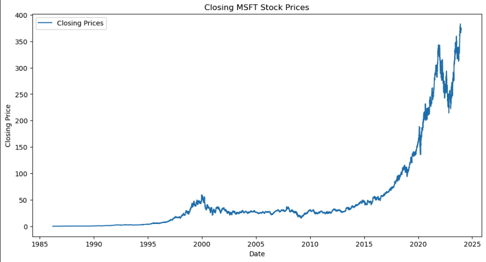
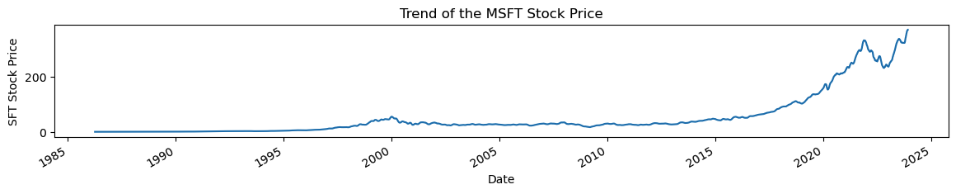
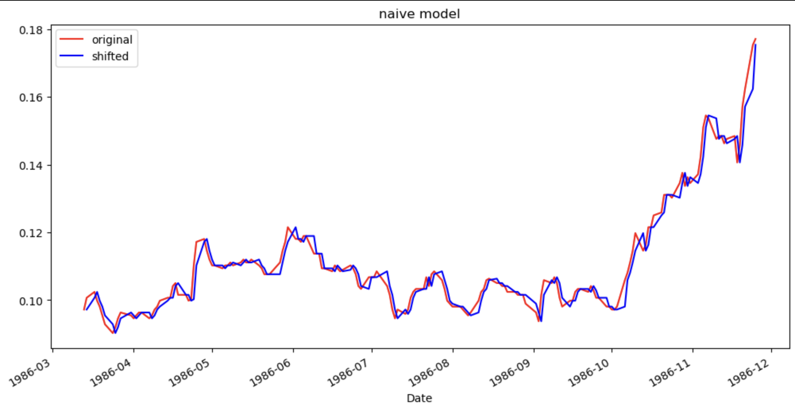
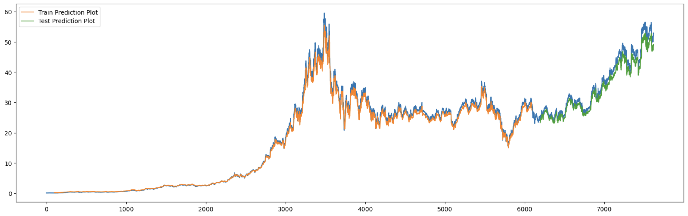

# Microsoft Stock Time-Series Analysis


## Overview


## Business Problem

Investors, such as day traders and short-term investors, are actively involved in stock trading. They are interested in making informed trading decisions to capitalize on short-term price movements. Our challenge is to develop a predictive model that can forecast the direction of Microsoft stock prices over the next trading day.

## Data Understanding and Analysis

The dataset was obtained from Yahoo! Finance and it consists of the date, opening price, maximum price, minimum price, closing price, adjusted closing price, and volume of the Microsoft stock. The data had been obtained from March 13, 1986 to December 26, 2023. The observations are collected during weekdays and not on weekends in accordance to the opening and closing of the New York Stock Exchange (NYSE). The dataset had 9524 observations.

We were concerned only with the closing stock price. Therefore, the master dataset was a Series that consisted of the date, which was used as index, and the closing price.



Through the eye test, we can see that the data is not stationary. This was confirmed with a P-Value of 1.00 when Dickey-Fuller test was done.



Looking closely at the trend, we can see the upward trajectory of MSFT stock price in the past 9 years. This year alone, MSFT stock price rose 55% under the leadership of CNN Business' CEO of the year, Satya Nadella.


## Modeling

### Baseline Model: Naive Model

Naive model is done based on our current data shifted by one step. In other words, we used values from last observation to forecast our future predictions.




### LSTM Model

LSTM model utilizes neural network to make stock predictions.



Upon evaluation, the MSE of the Training and Test set were 21 and 35, respectively, which was an indication that this model is a good predictor.

## Recommendations

- **Positive Market Perception**

Higher stock price proves that the market has high confidence in Microsoft.

- **Upward Trend**

Based on our analysis, MSFT stock price has an upward trend since 2016, which is beneficial for long-term investments.

- **LSTM Model Predictions**

Utilizing LSTM neural network, we can forecast future stock price with confidence.

## Future Insights

- **External Factors**

Stock prices are dependent upon factors outside the stock exchange. It is therefore crucial to include current events and other factors in predicting 

- **Real-Time Forecasting**

For day traders, decisions need to be made on site and in real-time. Therefore, further research needs to be done for an application to give them forecasting in real-time to make decisions at the moment.

- **Enhancing Model Robustness**

All model needs to be tuned every now and then, and for robustness of the model, we need to enhance it by feeding it more data as it comes in.

## Outside Research

- [Microsoft Corporation](https://www.britannica.com/topic/Microsoft-Corporation)

- [Microsoft’s Satya Nadella is CNN Business’ CEO of the Year](https://www.cnn.com/2023/12/26/tech/satya-nadella-ceo-of-the-year/index.html)

- [Apple - 43 Year Stock Price History | AAPL](https://www.macrotrends.net/stocks/charts/AAPL/apple/stock-price-history)

## Appendix

The complete analysis can be found in the <a href="microsoft_stock_analysis.ipynb">Jupyter Notebook</a> and in our <a href="Microsoft_Stock_Time_Series_Analysis.pdf">presentation</a>.


## Repository Structure

You are in the README.md. 'microsoft_stock_analysis.ipynb' contains the jupyter notebook that explains our data science steps for you to replicate. 'Microsoft_Stock_Time_Series_Analysis.pdf' contains our presentation slides that sums up important information for our audience. In 'Data' you will be able to see the datasets we worked with. Likewise, 'Images' will contain images used.

```bash

├── Data                                       <- Folder consisting dataset used in this project

├── Images                                     <- Folder consisting images used in this project

├── .gitignore                                 <- Contains list of files ignored from GitHub

├── Microsoft_Stock_Time_Series_Analysis.pdf   <- Slide Presentation of the project

├── README.md                                  <- Contains README file consisting summary of the project

└── microsoft_stock_analysis.ipynb             <- Jupyter notebook of the project containing codes and analysis